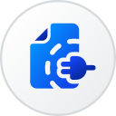
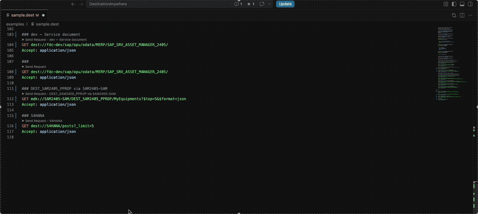
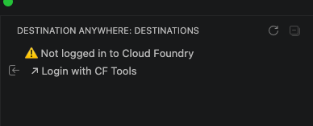
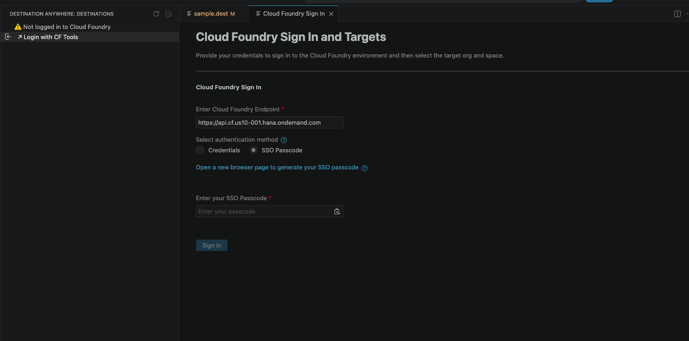
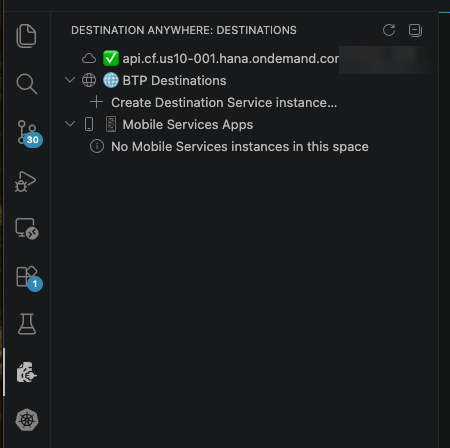
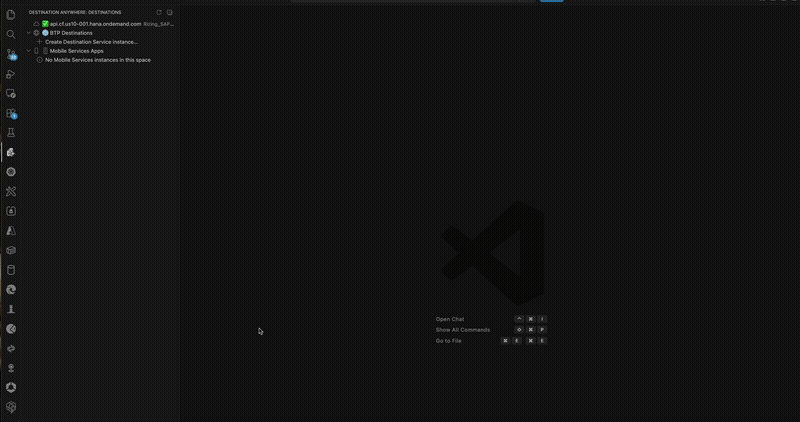
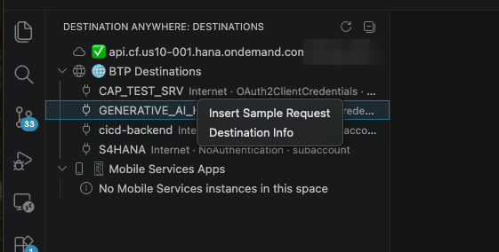
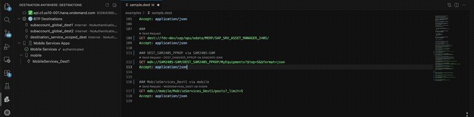
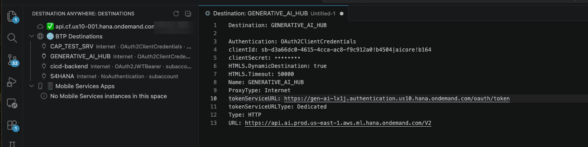
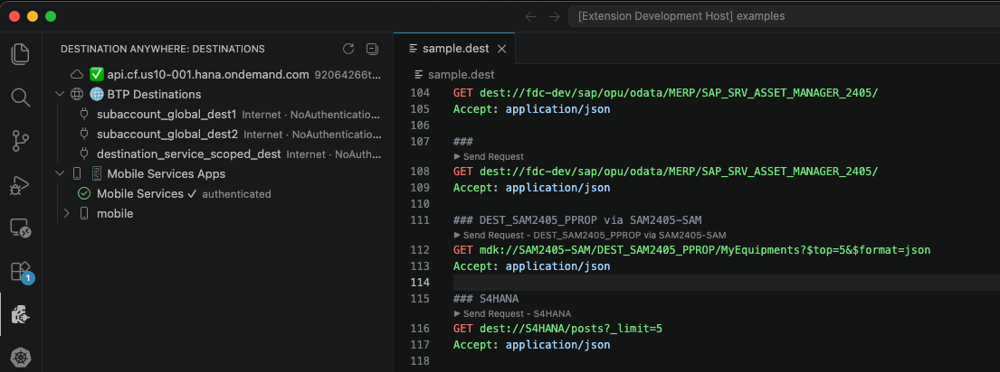

<p align="center">
  
</p>

<h1 align="center">Destination Anywhere</h1>

<p align="center">
  <strong>The REST client for SAP BTP developers.</strong><br>
  Send HTTP and OData requests straight from VS Code — with zero-config destination resolution.
</p>

<p align="center">
  <code>dest://</code> for BTP subaccount destinations &nbsp;·&nbsp;
  <code>mdk://</code> for Mobile Services app destinations &nbsp;·&nbsp;
  Variables &amp; environments &nbsp;·&nbsp;
  Sidebar browser &nbsp;·&nbsp;
  On-premise support
</p>

---

## Why Destination Anywhere?

You're coding in VS Code, you need to test an API call against your BTP backend, and suddenly you're out of your editor — opening the BTP cockpit to look up a destination URL, switching to Postman or Rest Client to craft the request, grabbing a bearer token from another tool, and forget about reaching on-premise systems that are only accessible from SAP BTP via Cloud Connector. Every round-trip breaks your flow.

**Destination Anywhere** keeps you where you already are. Type `dest://MY_DESTINATION/path` in a `.dest` file, press <kbd>Cmd+Alt+R</kbd>, and the extension resolves the real URL, handles authentication, and shows you the response — without ever leaving VS Code.

No cockpit tab. No manual tokens. No pasting URLs you looked up somewhere else. Just your editor.

<p align="center">
  
  <br>
  <em>Write a request, click Send, get the response. That's it.</em>
</p>

---

## From Install to First Request

Here's what happens the first time you open the extension — no setup guide needed, the sidebar walks you through it.

### 1. You're not logged in yet

Open the **Destination Anywhere** panel in the sidebar. If you're not logged in to Cloud Foundry, the extension tells you immediately and offers a one-click login button.

<p align="center">
  
  <br>
  <em>The sidebar detects your CF login state automatically.</em>
</p>

### 2. Log in without leaving VS Code

Click **Login with CF Tools** and the CF sign-in form opens right inside VS Code. Enter your SSO passcode or credentials — no terminal needed.

<p align="center">
  
  <br>
  <em>CF Tools sign-in, right inside VS Code. SSO passcode or credentials — your choice.</em>
</p>

### 3. No Destination Service? No problem.

> **Don't have a Destination Service instance?** Most SAP BTP projects already have one — if yours does, the extension reuses it automatically and you'll never see this step. If not, here's why you need one: Destinations in SAP BTP are configured at the subaccount level in the BTP cockpit — they exist independently of any service instance. But the only way to **read** those destinations programmatically is through the [Destination Service REST API](https://help.sap.com/docs/connectivity/sap-btp-connectivity-cf/consuming-destination-service). That API requires OAuth2 credentials (`clientid`, `clientsecret`, `uri`) which you can only obtain from a Destination Service **instance** and its **service key** in your CF space. So even though you never need an instance to *create* destinations, SAP BTP requires one just to *query* them. No instance, no credentials, no API access.

> **🔓 Full transparency — this extension and the router app are both open source.** When you use on-premise destinations, Destination Anywhere deploys a small Express app to your CF space to relay requests through Cloud Connector. The entire source code — both the extension and the router app — is right here in this repository. The router is a single-file Express server (~100 lines) under [`router-app/`](router-app/) that you can read, audit, and even deploy manually yourself if you prefer:
>
> ```bash
> cd router-app
> # Edit manifest.yml with your service instance names, then:
> cf push
> ```
>
> See [`router-app/README.md`](router-app/README.md) for full manual deployment instructions. Nothing hidden, nothing proprietary — you're always in control of what runs in your CF space.

When you open the sidebar, the extension scans your CF space for any existing `destination` service instance. **If you already have one** — from another project, a managed app router, or manual setup — **it reuses that.** Nothing is created, nothing changes.

If no instance exists, the sidebar shows a **"Create Destination Service instance…"** link. Click it and the extension creates a `lite` plan instance named `dest-anywhere-dest` with a service key `dest-anywhere-dest-key`. This is free, one-time, and persists across sessions.

<p align="center">
  
  <br>
  <em>No Destination Service instance in this space — click to create one on the free lite plan.</em>
</p>

<p align="center">
  
  <br>
  <em>Auto-provisioning in action: the extension creates a service instance, generates keys, and loads your destinations.</em>
</p>

### 4. Browse your destinations

After provisioning, your BTP destinations appear in the sidebar tree. Each destination shows its type (Internet / OnPremise) and authentication method. Right-click any destination to **insert a sample request** into your `.dest` file or view its full configuration.

<p align="center">
  
  <br>
  <em>Right-click a destination: insert a ready-to-send request or inspect its properties.</em>
</p>

<p align="center">
  
  <br>
  <em>One click inserts a complete request block with the right URL and headers.</em>
</p>

### 5. Inspect destination details

Want to see what a destination resolves to? Click **Destination Info** and a panel opens showing the resolved URL, authentication type, proxy settings, and all configuration properties — with sensitive values masked.

<p align="center">
  
  <br>
  <em>Full destination properties at a glance — URL, auth type, token endpoint, and more.</em>
</p>

---

## Mobile Services (`mdk://`)

Destination Anywhere also supports **SAP Mobile Services** destinations via the `mdk://` protocol. The first time you use it, the extension opens your browser for SAP BTP authentication — no extra confirmation needed.

Your browser opens to the SAP BTP login page. Once authenticated, the sidebar shows your Mobile Services apps and their destinations alongside BTP destinations. Use `mdk://AppId/DestName/path` to send requests:

```http
### Equipment list via Mobile Services
GET mdk://SAM2405/DEST_SAM2405_PPROP/MyEquipments?$top=10&$format=json
Accept: application/json
```

<p align="center">
  
  <br>
  <em>Mobile Services authenticated (✓). Both dest:// and mdk:// requests in a single .dest file.</em>
</p>

---


## Usage Examples

### BTP Destinations (`dest://`)

```http
@system = MY_S4_SYSTEM
@service = /sap/opu/odata/sap/API_BUSINESS_PARTNER

### Metadata
GET dest://{{system}}{{service}}/$metadata
Accept: application/xml

### Business partners with filter + expand
GET dest://{{system}}{{service}}/A_BusinessPartner?$filter=BusinessPartnerCategory eq '1'&$expand=to_BusinessPartnerAddress&$top=5&$format=json
Accept: application/json

### Create a business partner
POST dest://{{system}}{{service}}/A_BusinessPartner
Content-Type: application/json

{
  "BusinessPartnerCategory": "1",
  "BusinessPartnerFullName": "Acme Corp"
}
```

### Mobile Services Destinations (`mdk://`)

```http
### Equipment list via MDK
GET mdk://SAM2405.SAM.WIN/DEST_SAM2405_PPROP/MyEquipments?$top=10&$format=json
Accept: application/json

### Create a notification
POST mdk://SAM2405.SAM.WIN/DEST_SAM2405_PPROP/Notifications
Content-Type: application/json

{
  "NotificationType": "PM",
  "Description": "Equipment failure reported via MDK"
}
```

### Plain HTTP (no BTP)

```http
@host = https://jsonplaceholder.typicode.com

### Get a post
GET {{host}}/posts/1

### Create a post
POST {{host}}/posts
Content-Type: application/json

{
  "title": "Hello from Destination Anywhere",
  "body": "Works with any HTTP endpoint.",
  "userId": 1
}
```

### Variables & Environments

Define `@var = value` inline, use `.env` files, or configure per-environment variable sets in VS Code settings:

```json
"destinationAnywhere.environmentVariables": {
  "dev":  { "system": "MY_DEV_SYSTEM",  "base": "/sap/opu/odata/sap" },
  "prod": { "system": "MY_PROD_SYSTEM", "base": "/sap/opu/odata/sap" }
}
```

Then in your `.dest` file:

```http
### Switches based on active environment
GET dest://{{system}}{{base}}/API_BUSINESS_PARTNER/A_BusinessPartner?$top=5
```

Switch via **Command Palette** → `Destination Anywhere: Switch Environment`.

---

## On-Premise Destinations

On-premise destinations route through SAP Cloud Connector, which is only reachable from inside Cloud Foundry. Destination Anywhere gives you two options:

| Mode | How it works | When to use |
|------|-------------|-------------|
| **Router app** (recommended) | One-click deploy of a lightweight Express app to your CF space. It uses SAP Cloud SDK to tunnel requests through Cloud Connector. XSUAA authentication is enforced. [View the source code →](router-app/) | No local Cloud Connector or VPN. |
| **Direct mode** | Sends requests directly to the destination URL using resolved credentials. | Local Cloud Connector or VPN can reach the backend. |

Deploy the router from the sidebar: expand **BTP Destinations**, and click **Deploy On-Premise Router**. The extension provisions Connectivity and XSUAA service instances automatically.

---

## Key Features

| Feature | What it does |
|---------|-------------|
| **`dest://` protocol** | Route requests through SAP BTP subaccount destinations. The extension resolves the real URL and injects authentication headers (Basic, OAuth2, SAML, Principal Propagation) automatically. |
| **`mdk://` protocol** | Send requests through SAP Mobile Services App Router. Authenticate once via browser, then fire OData requests against MDK app destinations. |
| **Sidebar panel** | Browse all BTP destinations and Mobile Services apps in a tree view. Right-click to insert a sample request or view destination details. |
| **On-premise routing** | Access on-premise systems behind Cloud Connector. Deploy a lightweight router app to your CF space with one click — or use direct mode with a local Cloud Connector / VPN. |
| **Variables & environments** | Define `@var = value` in your file, use `.env` files, or configure per-environment variable sets in settings. Switch environments from the Command Palette. |
| **Syntax highlighting** | Dedicated `.dest` language with a TextMate grammar — methods, URLs, `dest://` / `mdk://` schemes, headers, variables, and JSON bodies are all highlighted. |
| **CodeLens** | Click "▶ Send Request" above any request block. Or press <kbd>Cmd+Alt+R</kbd>. |
| **Smart autocomplete** | HTTP methods, common headers, content types, and `dest://` / `mdk://` URL snippets. |
| **Response panel** | Status code (color-coded), response time, size, headers table, and pretty-printed body with JSON syntax highlighting and XML indentation. Copy body to clipboard in one click. |
| **CF guard** | Detects CF CLI installation and login state before making any BTP calls. Offers one-click login via CF Tools or a terminal fallback. Log out from the sidebar title bar. |
| **Auto-provisioning** | No Destination Service instance? The extension creates one for you (`lite` plan). Service keys are created and rotated as needed. |
| **Caching** | Resolved destinations, service credentials, and OAuth tokens are cached with configurable TTL. Clear everything with one command. |

---

## Commands

All commands are available in the Command Palette (<kbd>Cmd+Shift+P</kbd> / <kbd>Ctrl+Shift+P</kbd>):

| Command | Description |
|---------|-------------|
| `Destination Anywhere: Send Request` | Send the request under the cursor |
| `Destination Anywhere: Switch Environment` | Change the active variable environment |
| `Destination Anywhere: Clear Destination Cache` | Purge all cached destinations, credentials, and tokens |
| `Destination Anywhere: Login to Cloud Foundry` | Open CF login via CF Tools or terminal |
| `Destination Anywhere: Logout from Cloud Foundry` | Log out from CF and clear all cached credentials |
| `Destination Anywhere: Login to Mobile Services` | Authenticate with SAP Mobile Services via browser |
| `Destination Anywhere: Open Destinations Panel` | Focus the sidebar tree view |
| `Destination Anywhere: Create Destination Service instance` | Create a Destination Service `lite` instance in the current CF space |
| `Destination Anywhere: Deploy On-Premise Router` | Deploy the Express-based router app for on-premise connectivity |
| `Destination Anywhere: Uninstall On-Premise Router` | Remove the router app and its service instances |

**Keyboard shortcut:** <kbd>Cmd+Alt+R</kbd> / <kbd>Ctrl+Alt+R</kbd> → Send Request

---

## Configuration

| Setting | Default | Description |
|---------|---------|-------------|
| `destinationAnywhere.timeout` | `30000` | Request timeout (ms) |
| `destinationAnywhere.followRedirects` | `true` | Follow HTTP redirects |
| `destinationAnywhere.rejectUnauthorized` | `true` | Reject unauthorized SSL certificates |
| `destinationAnywhere.defaultHeaders` | `{}` | Headers included in every request |
| `destinationAnywhere.environmentVariables` | `{}` | Per-environment variable sets |
| `destinationAnywhere.activeEnvironment` | `""` | Currently active environment |
| `destinationAnywhere.destinationServiceUrl` | `""` | Manual Destination Service URL override (auto-discovered by default) |
| `destinationAnywhere.mobileServicesUrl` | `""` | Manual Mobile Services URL override |
| `destinationAnywhere.destinationCacheTTL` | `300` | Destination cache TTL (seconds) |
| `destinationAnywhere.logLevel` | `"info"` | Log level: `off`, `error`, `warn`, `info`, `debug` |

---

## Requirements

- **VS Code** 1.87+
- **CF CLI** — for `dest://` and `mdk://` features ([install guide](https://github.com/cloudfoundry/cli/releases))
- **SAP BTP subaccount**

> Plain HTTP requests (`https://...`) work without CF CLI or any SAP services.

---

## Installation

Install from the [Visual Studio Code Marketplace](https://marketplace.visualstudio.com/items?itemName=aydin-ozcan.destination-anywhere):

1. Open VS Code
2. Press `Ctrl+Shift+X` (Windows/Linux) or `Cmd+Shift+X` (macOS) to open the Extensions view
3. Search for **Destination Anywhere**
4. Click **Install**

Or install from the command line:

```bash
code --install-extension aydin-ozcan.destination-anywhere
```

---

## License

See [LICENSE](LICENSE) for details.
